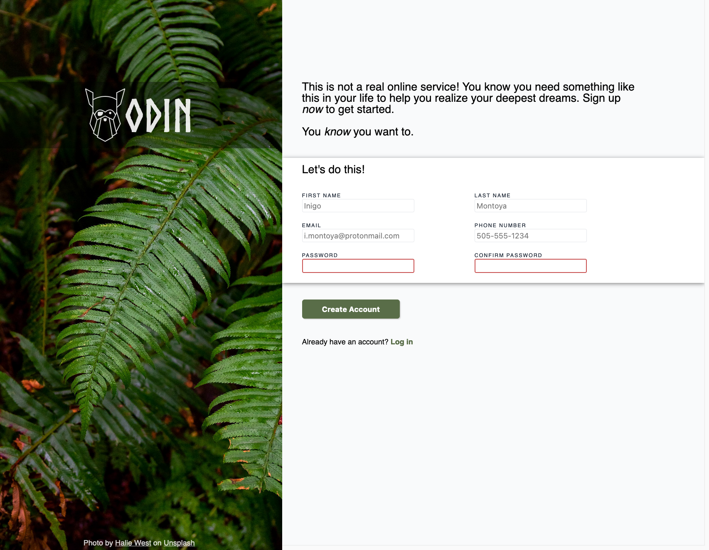

# # Sign-up Form

This webpage is a sign-up form template. It utilizes HTML and CSS only.

[Click here to see a live-preview hosted on Github).](https://mononoken.github.io/sign-up-form/)

## Table of Contents

- [General Information](#general-information)
- [Acknowledgements](#acknowledgements)
- [Reporting Issues / Feedback / Contact](#reporting-issuesfeedbackcontact)

## General Information

This project aims to reinforce knowledge of HTML form elements. These include elements such as `<button>`, `<label>`, and `<input>`. This knowledge primarily comes from The Odin Project (see Acknowledgements) and [MDN Web Docs](https://developer.mozilla.org/en-US/docs/Learn/Forms).

Furthermore, this project is my first project that I am writing using [Neovim](https://neovim.io/). In turn, it is also the first one that I am using all of the many plug-ins that I picked out while configuring Vim. Most notable additions include [Emmet-vim](https://github.com/mattn/emmet-vim) and [Lazygit](https://github.com/kdheepak/lazygit.nvim) as well as their parent projects.

## Acknowledgements

- [The Odin Project](https://www.theodinproject.com), my primary guide in the vast sea of web-development learning.
  - For providing this project idea ([see the instructions for this assignment here](https://www.theodinproject.com/lessons/intermediate-html-and-css-sign-up-form))
  - And the Discord community!
- [Elijah Manor](https://www.youtube.com/@ElijahManor), whose videos on LazyVim helped guide me to getting a workable Vim for me.

## Reporting Issues/Feedback/Contact

Bug reports are greatly appreciated. You may create a new issue with a description of the problem, and the steps leading up to it.

PRs are kindly appreciated.

You may also contact me at: mail@feelsufo.com
